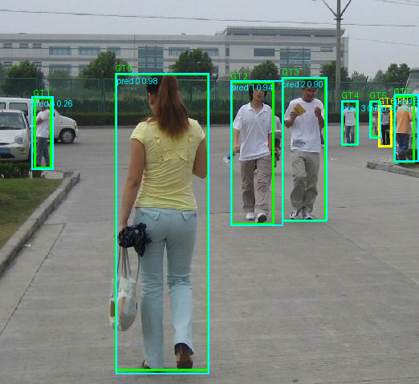
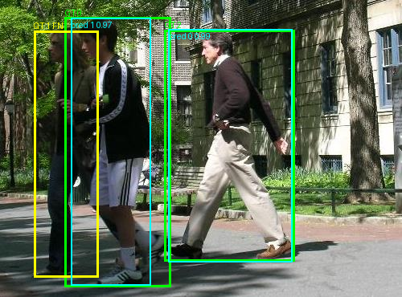
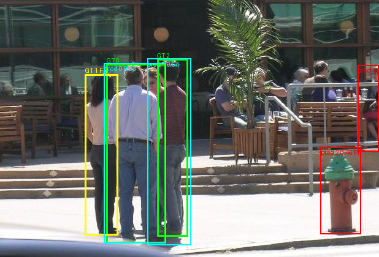
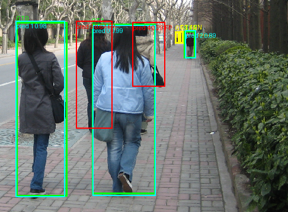

# Visually reviewed detection failures

Both validation-selected models were tested on the same 26 images (66 annotated
pedestrians). Analysis uses confidence **0.25**, NMS IoU **0.7**, and matching
IoU **>= 0.5**, with fixed 640×640 inference padding (`rect=False`). Predictions are processed in descending confidence; each may
match one unmatched ground-truth box. Every GT can be used only once.
Unmatched predictions are FP; unmatched GT boxes are FN.

| Condition | TP | FP | FN | Precision at 0.25 | Recall at 0.25 |
|---|---:|---:|---:|---:|---:|
| Baseline | 61 | 5 | 5 | 0.9242 | 0.9242 |
| Strong augmentation | 62 | 11 | 4 | 0.8493 | 0.9394 |

These counts come from `results/predictions/*.json`. They use a fixed confidence
and differ from the main table's Ultralytics maximum-smoothed-F1 operating point.
The experiment reduces missed detections at 0.25 but adds false positives and
has lower AP, particularly at stricter localization thresholds.

Green = matched GT; yellow = FN GT; cyan = matched prediction; red = FP.
Prediction labels show confidence. The following categories were assigned after
visually inspecting the saved images; likely causes are hypotheses, not measured
causal explanations.

## Case 1: small, distant pedestrians — baseline false negatives

`FudanPed00058.png`: one FN, no FP. Large foreground pedestrians are detected,
but the distant pedestrian in the narrow yellow box on the right (GT 6) has
no matched prediction above 0.25. Its box is only about 17 pixels wide and 51
pixels tall at original resolution. Limited visible detail, distance, and
the overlapping people on the right likely reduce confidence. YOLO11n's small
capacity and this small training dataset may limit distant-person detection.
The figure establishes absence at this operating point; it does not establish
whether the model produced lower-confidence candidates.

## Case 2: overlapping people — baseline false negative

`PennPed00090.png`: one FN, no FP. The yellow GT 1 on the left corresponds to a
person partly hidden behind the detected person in dark sportswear. Two people
are detected with high confidence (0.97 and 0.99), but the overlapping left
person is missed. Occlusion and closely overlapping silhouettes are plausible
reasons. Detecting two separate people from similar overlapping appearances is
a limitation; this figure alone cannot distinguish low confidence from NMS
suppression. We did not tune NMS or confidence using this test case.

## Case 3: fire hydrant — augmented false positive and false negative

`PennPed00056.png`: two FP and one FN. The red prediction at the lower right is
a fire hydrant, labeled person at confidence **0.46**. It is visibly a background
object rather than a pedestrian. Its upright shape and cap-like top may resemble
a person at the detector's feature level. The experiment has a background
confusion limitation and has not learned a sufficiently discriminative person
appearance from the small dataset. Separately, the woman on the left (yellow
GT 1) is partly occluded by the other pedestrians and is missed. Two pedestrians
are matched at confidence approximately 0.83 and 0.54. The second FP (0.26) is on a visible person
at the far right without a corresponding supplied GT; it may reflect an
annotation omission rather than background confusion.

## Case 4: apparent annotation omission and tiny pedestrians

`FudanPed00063.png`: two FP and two FN. The red box at confidence **0.67**
surrounds a visibly person-like dark-clothed walker behind the foreground woman,
but there is no corresponding converted GT instance. It is therefore an FP
under the supplied annotations. Visual inspection suggests an annotation
omission rather than ordinary background confusion. We retain the official
labels and do not relabel the held-out set. The additional FP (0.29) is a partial box beside the foreground woman;
its interpretation is ambiguous because several people overlap there.
The two yellow distant GT boxes
are only about 6–7 pixels wide and are missed, showing another small-object
limitation. Reported FP counts describe agreement with supplied annotations,
which can differ from the number of actual background hallucinations.

## Interpretation

The tested stronger augmentation does not improve overall AP on this split.
At confidence 0.25 it trades more detections for more false positives; the
hydrant illustrates a clear background error. Small/distant and occluded
pedestrians remain challenging. Future work could examine small-object detail,
occlusion examples, and annotation completeness using training/validation data.
Those are proposed future investigations, not additional experiments performed
here. A single small split and one seed do not demonstrate general superiority
across datasets or random seeds.
